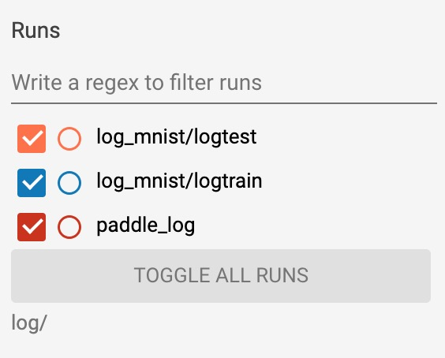

# tb_paddle
[](https://github.com/linshuliang/tb_paddle/blob/master/README.md)
[](LICENSE)

## 简介

tb_paddle 是一个用于在 TensorBoard 中查看 Paddle 打点数据的可视化工具。

目前 tb_paddle 支持 
[SCALARS](instructions/SCALARS_instructions.md),
[HISTOGRAMS](instructions/HISTOGRAMS_instructions.md),
[GRAPHS](instructions/GRAPHS_instructions.md),
[IMAGES](instructions/IMAGES_instructions.md),
[AUDIO](instructions/AUDIO_instructions.md),
[TEXT](instructions/TEXT_instructions.md),
[PROJECTOR](instructions/PROJECTOR_instructions.md),
[PR CURVES](instructions/PR-CURVES_instructions.md),
[MESH](instructions/MESH_instructions.md),
[CUSTOM SCALARS](instructions/CUSTOM_SCALARS_instructions.md),
<a href="#1">DISTRIBUTIONS</a> 这11个栏目的功能。

## 特别致谢

tb_paddle 是在 [tensorboardX](https://github.com/lanpa/tensorboardX) 的基础上修改的，
tb_paddle 的框架和 API 接口均沿用了 tensorboardX。与 tensorboardX 不同的是，
tb_paddle 的API接口的参数类型为`numpy.ndarray`和Python基本数据类型，
并根据 Paddle 框架重新实现了GRAPHS栏目的计算图显示。
此处由衷感谢[Tzu-Wei Huang](https://github.com/lanpa)的开源贡献。

## 安装

```
# 安装 tb-nightly
pip install tb-nightly==1.15.0a20190818

# 安装 tb_paddle
git clone https://github.com/linshuliang/tb_paddle.git
cd tb_paddle
python setup.py bdist_wheel
pip install dist/tb_paddle-0.1-py2.py3-none-any.whl
```

## TensorBoard 栏目

### SCALARS

TensorBoard 的[SCALARS](instructions/SCALARS_instructions.md)栏目显示折线图。

**SCALARS**栏目能进行的交互操作有：

* 点击每个图表左下角的图标可以展开图表。
* 选择图表中的矩形区域可以放大。
* 双击图表将缩小。
* 鼠标停留在图表上会产生十字线，并在图表的下方显示一个数值框。

### HISTOGRAMS

TensorBoard 的[HISTOGRAMS](instructions/HISTOGRAMS_instructions.md)栏目显示直方图。

每个图表显示数据的时间切片，其中每个切片是给定步数的直方图，步数越大的切片显示越靠前。

**HISTOGRAM** 的左侧面板可以切换`Histogram mode`，支持以下两种模式：

* OFFSET  : 显示直方图。
* OVERLAY : 旋转视角，使每个直方图切片呈现为一条线。

<a name="1"></a>
### DISTRIBUTIONS

TensorBoard 的 **DISTRIBUTIONS** 栏目用于显示行向量数据的统计特性。

当通过`class SummaryWriter`的成员函数`add_histogram`,`add_histogram_raw`添加行向量数据，
则会在 TensorBoard 的前端界面中出现 **HISTOGRAM** 和 **DISTRIBUTION** 两个栏目。

**DISTRIBUTION** 栏目中的每一个图表中都有9条线，每条线表示数据分布的百分位数。

其中，底线显示最小值随时间的变化趋势，中间的线显示平均值的变化趋势，顶线显示最大值的变化趋势。
从上而下，依次为正态分布的标准差边界 `[maximum, μ+1.5σ, μ+σ, μ+0.5σ, μ, μ-0.5σ, μ-σ, μ-1.5σ, minimum]`，
使得从内侧到外侧的着色区域分别为宽度`[σ，2σ，3σ]`。

### GRAPHS

TensorBoard 的[GRAPHS](instructions/GRAPHS_instructions.md)栏目显示计算图。

此功能有助于让用户更好地理解神经网络的结构，并进一步调试和优化神经网络的设计。

* Paddle 提供了`paddle.fluid.name_scope()`来设置名称空间，以实现计算图的缩放。
* 由于 Paddle 使用 [Program](https://paddlepaddle.org.cn/documentation/docs/zh/1.5/beginners_guide/programming_guide/programming_guide.html#permalink-5--program-) 
来描述神经网络模型，所以成员函数`add_paddle_graph`的参数为`fluid.Program`。

### IMAGES

TensorBoard 的[IMAGES](instructions/IMAGES_instructions.md)栏目显示图片和视频。

通过`class SummaryWriter`的成员函数`add_image`, `add_images`, `add_image_with_boxes`, `add_figure`添加图片数据，
则可在 **IMAGES** 栏目中看到相应的图片。

由于视频是多张图片连续展示的效果，所以通过`add_video`添加的视频数据，也在此栏目中展示。

为了减轻前后端交互的压力，每个子框中最多显示十张图片。

### AUDIO

TensorBoard 的[AUDIO](instructions/AUDIO_instructions.md) 栏目播放音频。

### TEXT

TensorBoard 的[TEXT](instructions/TEXT_instructions.md)栏目显示文本。

### PROJECTOR

[PROJECTOR](instructions/PROJECTOR_instructions.md)栏目的全称为`Embedding Projector`，
这是一个交互式的可视化工具。

通过降维方法将高维数据嵌入到 2D/3D 中显示，有助于直观地查看高维数据，便于查看数据点之间的关系。

目前 **PROJECTOR** 支持`PCA`, `t-SNE`, `UMAP`, `CUSTOM`这四种降维方法。

### PR CURVES

通过`class SummaryWriter`的成员函数`add_pr_curve`添加实参，则可根据预测的概率值及其对应的准确答案
来计算[precision-recall](https://en.wikipedia.org/wiki/Precision_and_recall)，
并将结果保存，以折线图的形式在[PR CURVES](instructions/PR-CURVES_instructions.md)栏目中展示。

### MESH

TensorBoard 的[MESH](instructions/MESH_instructions.md)栏目显示网格和点云。

网格和点云(Meshes and points cloud)是表示 3D 图形的重要数据类型，目前已广泛用于计算机视觉和计算机图形学中。

### CUSTOM SCALARS

TensorBoard 的[CUSTOM SCALARS](instructions/CUSTOM_SCALARS_instructions.md)栏目显示用户自定义组合的折线图。

通过收集函数`add_scalar`的`tag`和`runs`，可组合出新的布局`layout`，
将`layout`作为实参传入`class SummarWriter`的成员函数`add_custom_scalars`, `add_custom_scalars_multilinechart`, `add_custom_scalars_marginchart`，
就可以在同一张图表中同时绘制多条折线，以直观地进行数据比较和分析。

## 创建 SummaryWriter 类的对象

使用 tb_paddle，首先得创建类`SummaryWriter`的对象，然后才能调用对象的成员函数来添加打点数据。

创建 [class SummaryWriter](tb_paddle/writer.py#L177) 的初始化函数的定义：

```python
def __init__(self,
            logdir=None,
            flush_secs=10,
            max_queue=1000,
            purge_step=None,
            comment='',
            filename_suffix='',
            write_to_disk=True,
            **kwargs):
```

其中各个参数的含义为：

* `logdir` ：指定日志文件的存放路径，如果指定路径中没有 tfevents 文件，则新建一个 tfevents 文件，否则会向已有的 tfevents 文件中写数据。`logdir`的实参可以为`None`，则存放路径设为`./runs/DATETIME_HOSTNAME/`；
* `flush_secs` ：将打点数据从缓冲写到磁盘中，单位为秒；
* `max_queue` ： 缓冲区队列的最大长度；
* `purge_step` ：截断步数，重启打点时，tfevents 文件中步数大于`purge_step`的数据将被清除；
* `comment` ：如果`logdir`为`None`，则在默认存放路径中添加后缀。如果`logdir`不是`None`，那么该参数没有任何作用；
* `filename_suffix` ：event 文件名后缀；
* `write_to_disk` ：是否将打点数据写到磁盘。

## TensorBoard 启动命令

启动 TensorBoard 的命令为`tensorboard`，输入 `tensorboard --helpful` 则可查看此命令的帮助文档。

通常会用到`--logdir`, `--host`, `--port`, `--reload_interval`这几个选项：

```
tensorboard --logdir <path/to/dir> --host <host_name> --port <port_num> --reload_interval <time_secs>
```

这几个选项的详细解释:

1. `--logdir`

`--logdir` 用于指定 `tfevents` 文件的存放路径，可以同时指定多个目录，比如：

```
tensorboard --logdir ExperimentA:path/to/A_dir,ExperimentB:another/path/to/B_dir
```

只需在不同目录名间加上逗号(`,`) ，则可同时指定多个目录。

事实上，TensorBoard 会自动检查指定目录下的所有子目录中的 `tfevents` 文件，并在前端网页中
按 `Runs` 分类，比如目录结构为：

```
log
|
|____log_mnist
|    |
|    |___logtest
|    |
|    |___logtrain
|   
|____paddle_log
```

则在 TensorBoard 前端页面的左侧栏中显示为：

<p align="center">
<br/>
图1. TensorBoard Runs 选项 - 按目录分类 <br/>

2. `--host`

在本机运行`tensorboard`命令， `--host` 指定为 `0.0.0.0`， 在服务器上运行，`--host` 指定为服务器的地址。

3. `--port`

在本机运行`tensorboard`命令，`--port` 指定为 `6***`， 在服务器上运行，`--port` 指定为 `8***`。

4. `--reload_interval`

后端读取 `tfevents` 文件数据的时间间隔，单位为秒，默认为5秒。
