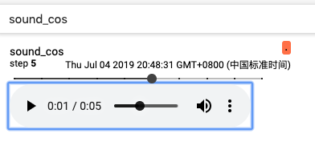

# AUDIO

TensorBoard 的[AUDIO](instructions/AUDIO_instructions.md) 栏目播放音频。

class SummaryWriter 中用于打点音频数据的成员函数为 `add_audio`。

`add_audio` 的定义与实现均在文件[../tb_paddle/summary_writer.py](../tb_paddle/summary_writer.py) 中。

### SummaryWriter 的成员函数 add_audio

Demo-1 add\_audio-demo.py

```python
# coding=utf-8
import numpy as np
from tb_paddle import SummaryWriter

writer = SummaryWriter('./log')

sample_rate = 44100
data = np.zeros(sample_rate * 5)

for step in range(10):
    for i in range(data.shape[0]):
        data[i] = np.cos(np.pi * np.random.randn())

    writer.add_audio('sound_cos', data, step, sample_rate)

writer.close()
```

执行以下指令，启动服务器：

```
python add_audio-demo.py
tensorboard --logdir ./log --host 0.0.0.0 --port 6066
```

打开浏览器地址 [http://0.0.0.0:6066/](http://0.0.0.0:6066/) ，即可播放音频：

<p align="center">
<br/>
图1. AUDIO 栏目播放音频展示图 <br/>
</p>
