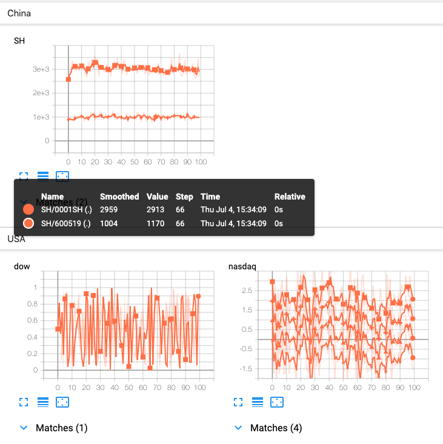
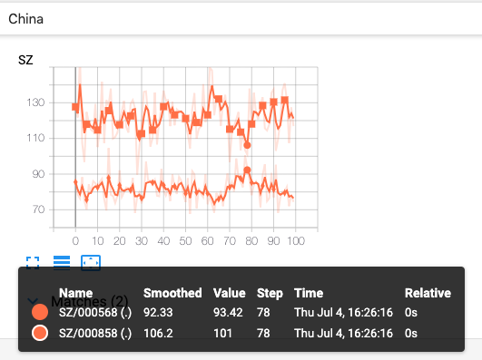
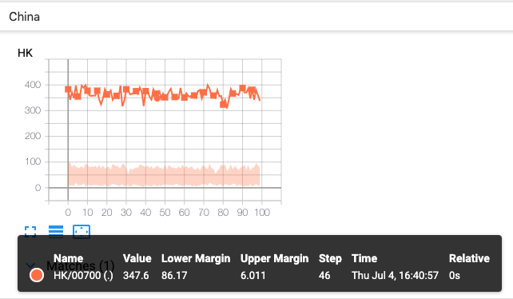

# CUSTOM SCALARS

通过函数`add_scalar`和`add_scalars`添加标量数据，会根据`tags`和`runs`来进行分类，进而在 Tensorboard 中显示。通过`CUSTOM SCALARS`的成员函数来自定义分类，有助于用户进行模型比较和数据分析。

举个例子，用户需要对比`resnet`模型和`vggnet`模型的 `loss`值，两个模型的`loss`值的折线图会根据`tags`和`runs`的值被分类到不同的位置，难以进行数值比较。使用`CUSTOM SCALARS`，用户可以把模型`resnet`的`loss`值和`vggnet`的`loss`值组合在同一个图表中显示，从而可直观地查看。

## Class Summary 的成员函数 add_custom_scalars

```python
def add_custom_scalars(self, layout):
    """Create special chart by collecting charts tags in 'scalars'.
    Note that this function can only be called once for each SummaryWriter() object.
    Because it only provides metadata to tensorboard, the function can be called before or after the training loop.

    :param layout: {category_name : charts}
                category_name 类型为 `string`，表示分类的名称；
                charts 类型为 `dict`，为 {title_name : list_of_properties}；
                    title_name 是这一个子类的名称;
                    list_of_properties 的第一个参数为该子类的类型，可选值为 `Multiline` 或者 `Margin`：
                        Multiline : 在一张图中，显示 tag 列表对应的所有折线；
                        Margin : 只显示第一个 tag 对应的折线，如果使用 Margin，则 tag 列表的数量必须为3, margin 常用于可视化置信区间。
                    list_of_properties 的第二个参数为 tag 列表。
    :type layout: dict
    """
```

Demo-1 add_custom_scalars-demo.py

```python
# coding=utf-8
from numpy.random import randn, rand
from tb_paddle import SummaryWriter

with SummaryWriter('log') as writer:
    for n_iter in range(100):

        writer.add_scalar('SH/0001SH', 3000 + 240*randn(), n_iter)
        writer.add_scalar('SH/600519', 1000 + 100*randn(), n_iter)

        t = randn()
        writer.add_scalar('nasdaq/microsoft', t, n_iter)
        writer.add_scalar('nasdaq/google', t - 1, n_iter)
        writer.add_scalar('nasdaq/cisco', t + 1, n_iter)
        writer.add_scalar('nasdaq/intel', t + 2, n_iter)

        writer.add_scalar('dow/aaa', rand(), n_iter)
        writer.add_scalar('dow/bbb', rand(), n_iter)
        writer.add_scalar('dow/ccc', rand(), n_iter)

    layout = {'China': {'SH': ['Multiline', ['SH/0001SH', 'SH/600519']]},
              'USA': {'dow': ['Margin', ['dow/aaa', 'dow/bbb', 'dow/ccc']],
                      'nasdaq': ['Multiline', ['nasdaq/microsoft', 'nasdaq/google', 'nasdaq/cisco', 'nasdaq/intel']]}}

    writer.add_custom_scalars(layout)
```

执行以下指令，启动服务器：

```
rm -rf ./log
python add_custom_scalars-demo.py
tensorboard --logdir ./log/ --host 0.0.0.0 --port 6066
```

打开浏览器地址 [http://0.0.0.0:6066/](http://0.0.0.0:6066/) ，则可在tensorboard 的 CUSTOM SCALAR 栏目中查看下图：

<p align="center">
<br/>
图1. add_custom_scalars - 显示折线图 <br/>
</p>


## Class Summary 的成员函数 add_custom_scalars_multilinechart

组合不同的折线图，便于直观地查看，进而有助于分析和比较。

函数定义：

```python
def add_custom_scalars_multilinechart(self, tags, category='default', title='untitled'):
    """此函数的三个输入参数，共同构成 add_custom_scalars 函数的输入参数 layout
    
    :param tags: list of tags that have been used in ``add_scalar()``.
    :type tags: list of string 
    :param category: category_name.
    :type category: string
    :param title: title_name.
    :type title: string
    """
    layout = {category: {title: ['Multiline', tags]}}
```

Demo-2 add_custom_scalars_multilinechart.py

```python
# coding=utf-8
from numpy.random import randn
from tb_paddle import SummaryWriter

with SummaryWriter('log') as writer:
    for n_iter in range(100):
        writer.add_scalar('SZ/000858', 123 + 12*randn(), n_iter)
        writer.add_scalar('SZ/000568', 81 + 8*randn(), n_iter)

    writer.add_custom_scalars_multilinechart(
        ['SZ/000858', 'SZ/000568'], category='China', title='SZ')
```

运行程序`add_custom_scalars_multilinechart`，则可在 tensorboard 的 CUSTOM SCALAR 栏目中查看下图：

<p align="center">
<br/>
图2. add_custom_scalars_multilinechart - 显示 `Multiline` 折线图 <br/>
</p>


## Class Summary 的成员函数 add_custom_scalars_marginchart

函数 add_custom_scalars_marginchart 常用于可视化置信区间。

函数定义：

```python
def add_custom_scalars_marginchart(self, tags, category='default', title='untitled'):
    """此函数的三个输入参数，共同构成 add_custom_scalars 函数的输入参数 layout
    
    :param tags: list of tags that have been used in ``add_scalar()``, tags 的长度必须为3。
    :type tags: list of string 
    :param category: category_name.
    :type category: string
    :param title: title_name.
    :type title: string
    """
    layout = {category: {title: ['Margin', tags]}}
```

Demo-3 add_custom_scalars_marginchart.py

```python
# coding=utf-8
from numpy.random import randn
from tb_paddle import SummaryWriter
import math

with SummaryWriter('log') as writer:
    for n_iter in range(100):
        writer.add_scalar('HK/00700', 360 + math.sqrt(360)*randn(), n_iter)
        writer.add_scalar('HK/000568', 9.78  + math.sqrt(9.78)*randn(), n_iter)
        writer.add_scalar('HK/00001', 80 + math.sqrt(80)*randn(), n_iter)

    writer.add_custom_scalars_marginchart(
       ['HK/00700', 'HK/00001', 'HK/000568'], category='China', title='HK')
```

运行程序`add_custom_scalars_marginchart.py`，则可在 tensorboard 的 CUSTOM SCALAR 栏目中查看下图：

<p align="center">
<br/>
图3. add_custom_scalars_marginchart - 显示 `Margin` 折线图 <br/>
</p>
