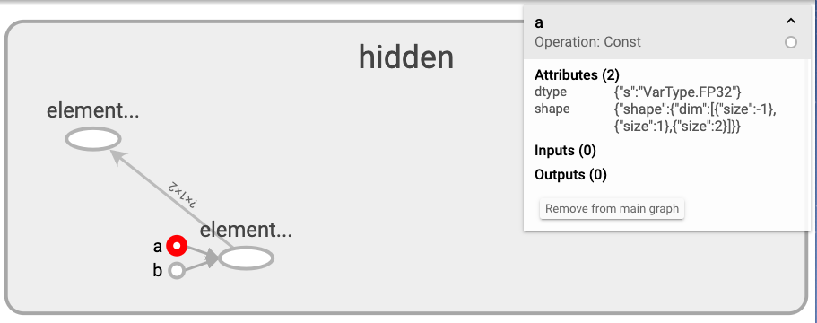

# GRAPHS

Tensorboard 的 **GRAPHS** 栏目用于显示计算图，有助于让用户更好地理解神经网络的结构，并进一步调试和优化神经网络的设计。

先简要介绍基本的使用：

* class SummaryWriter 的成员函数 [add_paddle_graph](../tb_paddle/summary_writer.py) 用于添加 Paddle 的计算图；
* 由于 Paddle 使用
[Program](https://paddlepaddle.org.cn/documentation/docs/zh/1.5/beginners_guide/programming_guide/programming_guide.html#permalink-5--program-) 
来描述神经网络模型，所以函数`add_paddle_graph`的第一个形参名为`fluid_program`，
传入的实参类型为 `<class 'paddle.fluid.framework.Program'>`；
* 函数`add_paddle_graph` 的第二个形参名为 `echo_vars`，
此变量用于控制计算图的输入/输出变量的显示，
当 echo\_vars=True 时显示输入/输出变量，否则只显示 OP。
* Paddle 提供了`paddle.fluid.name_scope()`来设置名称空间，以实现计算图的缩放。

接下来将详细介绍 **GRAPHS** 栏目的特性与使用方法。

## 名称范围和节点

一个复杂的计算图可能有数千个节点。当节点数量过多，很难直观地查看，甚至难以使用标准图工具来进行布置。
为了进行简化，可以对变量名称设定范围 `name_scope`。
tensorboard 的前端界面会根据 `name_scope` 来为计算图中的节点定义层次结构，默认情况下仅显示该层次结构的顶层。

Demo-1 fluid\_name\_scope-demo.py

```python
# coding=utf-8
import numpy
import paddle.fluid as fluid
from tb_paddle import SummaryWriter

with fluid.name_scope("hidden"):
    a = fluid.layers.data(name="a",shape=[1,2],dtype='float32')
    b = fluid.layers.data(name="b",shape=[1,2],dtype='float32')
    c = fluid.layers.elementwise_add(a,b)

writer = SummaryWriter("./log")
main_program = fluid.default_main_program()
writer.add_paddle_graph(fluid_program=main_program, echo_vars=True)
writer.close()
```

运行程序，并启动 tensorboard 服务器：

```
python fluid_name_scope-demo.py
tensorboard --logdir ./log --host 0.0.0.0 --port 6066
```

打开浏览器地址[http://0.0.0.0:6066/](http://0.0.0.0:6066/)，即可在 **GRAPHS** 栏目中查看计算图。

默认情况下仅显示该层次结构的顶层：

<p align="center">
<br/>
图1. fluid.name_scope 折叠图  <br/>
</p>

双击 **hidden** 即可展开折叠图，点击选择其中的`elementwise_add`节点:

<p align="center">
<br/>
图2. fluid.OP 示意图 <br/>
</p>

在 tensorboard 中， `OpNode` 显示为一个椭圆，右上角显示该节点的名称(hidden/elementwise\_add\_0\_)，
OP名称(Operation: elementwise\_add)，属性列表(Attributes)，输入(Inputs)和输出(Outputs)。

TensorFlow 图具有两种连接：数据依赖关系（Dataflow edge）和控制依赖关系（Control dependency edge）。
数据依赖关系显示两个`OpNode`之间的张量流动，该依赖关系显示为实线箭头，而控制依赖关系显示为虚线。

`Dataflow edge`上的数字为张量的形状（shape），
当`shape`中包含数字`-1`时，相应位置会显示为`?`号，表示 paddle 框架在计算时会自动补充为 batch\_size。

点击选择计算图中的小圆点**a**，paddle 将小圆点(`Constant`)用于表示该计算图的输入变量，
右上角的**Attributes**显示了该输入变量的数据类型`dtype`和形状`shape`。

<p align="center">
<br/>
图3. 输入变量（Input Variables）示意图 <br/>
</p>

点击选择计算图中的节点`elementwise_add_0`，paddle 用`OpNode`表示输出变量，其 `Operation`写定为`Output Variables`，
右上角的**Attributes**显示了该输入变量的数据类型`dtype`和形状`shape`。

<p align="center">
<br/>
图4. 输出变量（Output Variables）示意图 <br/>
</p>

**提示：** 要让图易于观看，按名称范围对节点进行分组至关重要。如果您要构建模型，名称范围可帮助您控制生成的直观展示。

为了完整地展示 GRAPHS 栏目的功能，
我们将[语义角色标注](https://github.com/PaddlePaddle/book/blob/develop/07.label_semantic_roles/README.cn.md)的
`infer_program`作为参数传给`add_paddle_graph`，详情可查看[add_paddle_graph-demo.py](../API_demo/add_paddle_graph-demo.py#L242)。

## GRAPHS 栏目界面介绍

GRAPHS 栏目的左侧为工具栏，各个按钮与选项的作用如下：

|选项|作用|
|:---|:---|
| Fit to Screen | 缩放计算图以适应当前的窗口，从而能从当前窗口看到整个计算图 |
| Download PNG| 保存计算图到本地磁盘，默认为.png 格式 |
| Run| 选择不同模型的 Graph 文件 |
| Tag | 选择不同标签的 Graph |
| Upload| 上传 Graph 文件，进而显示|
| Trace inputs| 当点击选定一个`OpNode`后，再点击`Trace inputs`，则计算图中没有直接/间接向该`OpNode`有输入关系的节点和数据流边都将被隐去 |


计算图中的元素名称及其相应的含义：

|名称|含义|
|:---|:---|
| Namespace | 命名空间，代表名称范围的高级别节点，双击可展开高级别节点|
| OpNode | 操作节点，单个指令节点|
| Unconnected series| 无连接序列，未相互连接的编号节点的序列 |
| Connected series | 连接序列 |
| Constant | 计算图的输入变量 |
| Summary | 总结节点 |
| Dataflow edge | 数据流向边，显示指令之间的数据流的边|
| Control dependency edge| 控制依赖边，显示指令之间的控制依赖关系的边 |
| Reference egde| 参考边，表明传出指令节点可以使传入张量发生变化的参考边 |

## 显示优化

为了让图易于查看，Tensorboard 设置了无连接序列(Unconnected series)来
聚集命名规则相同的节点，并为高级节点划分了辅助区域。

### Unconnected series

如果几个节点的名称除了末尾数字不同，比如 feed\_0, feed\_1, ..., feed\_7，
那么 Tensorboard 在显示时会默认将这些节点转化为无连接序列(Unconnected series)。例如：


<p align="center">
<br/>
图5. 无连接序列（Unconnected series）示意图 <br/>
</p>

点击右上角的`Ungroup the series of nodes`，则会取消聚集：

<p align="center">
<br/>
图6. 分散序列（Ungrouped nodes）示意图 <br/>
</p>

若想重新聚集，则点击右上角的`Group this series of nodes`。

### 辅助区域

在计算图中，有些节点的连接数特别多，我们将这些节点成为高级节点(high-degree OpNode)。
举个例子，很多节点都与初始化步骤中的`init`节点有控制依赖关系，
如果将`init`节点与其他节点都画在一张图中，可能会导致计算图很复杂以致难以查看。

为此，Tensorboard 会自动将高级节点分离到右上角的一个辅助区域(auxiliary area)，
用简洁的示意图画出高级节点与其他节点的连接关系。

例如：

<p align="center">
<br/>
图7. 辅助区域中的高级节点示意图 <br/>
</p>

为了进一步减轻显示的杂乱，辅助区域中的高级节点仅显示5个连接，
而将其余显示为 `... residual_num more`，其中`residual_num`为未显示的节点的数目。

### 张量形状（Tensor Shape）

当序列化的`GraphDef`中包含 `TensorShapeProto` 时，计算图会向数据流向边 (`Dataflow edge`) 添加张量的形状 (`shape`)。
数据流向边的宽度反映张量的大小，当张量的 `shape` 比较大时，相应的 `edge` 会比较粗，反之比较细。

### 颜色 （Color）

Tensorboard 的 **GRAPHS** 的左侧栏目中有一个 `Color` 选项，用来选择节点的配色方案。

* Structure ：默认的配色方法，按节点的结构来设置颜色，当两个`Namespace`节点具有相同的结构时，它们将显示相同的颜色。具有独特结构的节点显示为灰色。
* Device ：显示运行不同指令的设备，`Namespcae`节点根据其内部指令的设备比例来按比例着色。
* TPU Compatibility ：显示节点在TPU的兼容性，可兼容的节点显示为绿色，不兼容的节点显示为红色。

<p align="center">
<br/>
图9. Color\_Structure 节点配色示意图 <br/>
</p>

## 交互

在 Tensorboard 的 **GRAPHS** 中，您可以执行以下操作，以更好地查看计算图：

* 浏览计算图时，可进行平移和缩放；
* 点击并拖动，即可平移；
* 使用滚动手势即可缩放；
* 双击节点或点击`+`按钮，可展开代表一组指令的名称范围；
* 为了在缩放和平移时跟踪当前视点，右下角提供了一个全局地图；
* 要关闭打开的`Namescope`节点，请再次双击节点或点击它的`-`按钮；
* 点击一次选择一个节点，被选择节点的颜色将加深，其相关详细信息及其连接的节点将显示在右上角的信息卡中，例如：

<p align="center">
<br/>
图9. 显示了Namespace的信息卡，输入和输出是从Namespace内的OpNode的输入和输出合并而来的。Namespace的Attributes为空 <br/>
</p>

<p align="center">
<br/>
图10. 显示了OpNode的信息卡，有Attributes, Inputs, Outputs三个选项 <br/>
</p>

### 计算图布局

Tensorboard 通过交互式的按钮，可改变计算图的视觉布局。这不会改变计算图的执行流程，但可让网络结构显示得更加清晰。
通过右键点击节点，或者按下节点信息卡底部的按钮，可实现主图与右上角的辅助区域间的移动：

* `Remove from main graph`: 将该节点从主图中移到辅助区域；
* `Add to main graph`: 将节点从辅助区域移到主图。
