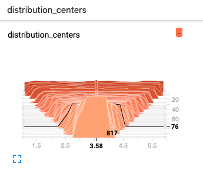
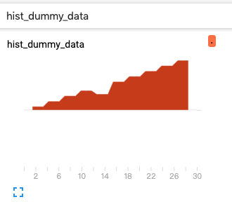

# HISTOGRAMS && DISTRIBUTIONS

## class SummaryWriter 中用于打点行向量数据的成员函数

* <a href="#1"> add_histogram </a>
* <a href="#2"> add_histogram_raw </a> 

当调用函数 `add_histogram` 或者 `add_histogram_raw`打点行向量数据，
则会在 TensorBoard 的网页界面中同时出现 **HISTOGRAM** 和 **DISTRIBUTION** 这两个栏目。

## HISTOGRAMS

TensorBoard 的 **HISTOGRAMS** 栏目显示直方图。

每个图表显示数据的时间切片，其中每个切片是给定步数的直方图，步数越大的切片显示越靠前。

**HISTOGRAM** 的左侧面板可以切换`Histogram mode`，支持以下两种模式：

* OFFSET  : 显示直方图。
* OVERLAY : 旋转视角，使每个直方图切片呈现为一条线。

## DISTRIBUTIONS

TensorBoard 的 **DISTRIBUTIONS** 栏目用于显示行向量数据的统计特性。

**DISTRIBUTION** 栏目中的每一个图表中都有9条线，每条线表示数据分布的百分位数。

其中，底线显示最小值随时间的变化趋势，中间的线显示平均值的变化趋势，顶线显示最大值的变化趋势。
从上而下，依次为正态分布的标准差边界 `[maximum, μ+1.5σ, μ+σ, μ+0.5σ, μ, μ-0.5σ, μ-σ, μ-1.5σ, minimum]`，
使得从内侧到外侧的着色区域分别为宽度`[σ，2σ，3σ]`。


<a name="1"></a>
### Class SummaryWriter 的成员函数 add_histogram

函数定义：

```python
def add_histogram(self, tag, values, global_step=None, bins='tensorflow', walltime=None, max_bins=None):
    """Add histogram to summary.
    
    :param tag: Data identifier.
    :type tag: string
    :param values: Values to build histogram.
    :type values: numpy.array
    :param global_step: Global step value to record.
    :type global_step: int
    :param bins: One of {'tensorflow','auto', 'fd', ...}
	         This determines how the bins are made. You can find other options in:
                 https://docs.scipy.org/doc/numpy/reference/generated/numpy.histogram.html
    :type bins: string
    :param walltime: Optional override default walltime (time.time()) of event.
    :type walltime: float
    """
```

demo-1 add_histogram-demo.py

```python
# coding=utf-8
from tb_paddle import SummaryWriter
import numpy as np

writer = SummaryWriter('./log/')

for step in range(1,101):
    interval_start = 1 + 2 * step/100.0
    interval_end = 6 - 2 * step/100.0
    data = np.random.uniform(interval_start, interval_end, size=(10000))
    writer.add_histogram('distribution centers', data, step)

writer.close()
```

执行以下指令，启动服务器：

```
rm -rf ./log
python add_histogram-demo.py
tensorboard --logdir ./log/ --host 0.0.0.0 --port 6066
```

打开浏览器地址 [http://0.0.0.0:6066/](http://0.0.0.0:6066/) ，则可在 tensorboard 的 HISTOGRAM 栏目中查看图表：

<p align="center">
<br/>
图1. add_histogram - 显示分布图  <br/>
</p>

<a name="2"></a>
### Class SummaryWriter 的成员函数 add_histogram_raw

add_histogram_raw 函数定义：

```python
def add_histogram_raw(self, tag, min, max, num, sum, sum_squares, bucket_limits,
                      bucket_counts, global_step=None, walltime=None):
    """Adds histogram with raw data.

    :param tag: Data identifier.
    :type tag: string
    :param min: Min value.
    :type min: float or int
    :param max: Max value.
    :type max: float or int
    :param num: Number of values.
    :type num: int
    :param sum: Sum of all values.
    :type sum: float or int
    :param sum_squares: Sum of squares for all values.
    :type sum_squares: float or int
    :param bucket_limits: Upper value per bucket, note that the bucket_limits returned from
                          `np.histogram` has one more element.
    :type bucket_limits: numpy.array
    :param bucket_counts: Number of values per bucket.
    :type bucket_counts: numpy.array
    :param global_step: Global step value to record.
    :type global_step: int
    :param walltime: Optional override default walltime (time.time()) of event.
    :type walltime: float
    
    :提示:
    len(bucket_limits) 如果不等于 len(bucket_counts)，会报错。 
    """
```

Demo-2  numpy.histogram-demo.py

```python
# coding=utf-8
import numpy as np
"""
def numpy.histogram(a, bins=10, range=None, weights=None, density=None)
    '''
    将 a 的各个数值按 bins 分类。
        
    :param:
      > a     : Input data.
                DataType : flattend array
      > bins  : 直方图的柱子.
                DataType : int or sequence of scalars.
                if bins is an integer, it defines the number of equal width bins in the given range.
                It defines a monotonically increasing array of bin edges, 
                including the rightmost edge, allowing for non-uniform bin widths. 
      > range : 数据范围.
                DataType : (float, float)
                The lower and upper range of bins.
                If not provided, range is simply (a.min(), a.max())
      > density: DataType bool.
                If False, the result will contain the number of samples in each bin.
                If True, the result is the value of probability density function at the bin.

    :return:
      > hist      : DataType array, The values of histogram.
      > bin_edges : DataType array, the bin edges.

    :Tips:
      len(bin_edges) = len(hist) + 1  
    '''
"""

print(np.histogram([1, 2, 1], bins=[0, 1, 2, 3]))
# (array([0, 2, 1]), array([0, 1, 2, 3]))

print(np.histogram(np.arange(4), bins=np.arange(5), density=True))
# (array([ 0.25,  0.25,  0.25,  0.25]), array([0, 1, 2, 3, 4]))

print(np.histogram([[1, 2, 1], [1, 0, 1]], bins=[0,1,2,3]))
# (array([1, 4, 1]), array([0, 1, 2, 3]))
```

Demo-3  add_histogram_raw-demo.py

```python
# coding=utf-8
import numpy as np
import random
from tb_paddle import SummaryWriter

dummy_data = []

for idx, value in enumerate(range(30)):
    for i in range(idx):
        dummy_data += [idx + random.random()]

values = np.array(dummy_data).astype(float).reshape(-1)
counts, limits = np.histogram(values)
sum_sq = values.dot(values)

with SummaryWriter('./log') as summary_writer:
    summary_writer.add_histogram_raw(
            tag='hist_dummy_data',
            min=values.min(),
            max=values.max(),
            num=len(values),
            sum=values.sum(),
            sum_squares=sum_sq,
            bucket_limits=limits[1:],
            bucket_counts=counts,
            global_step=0)
```

运行程序`add_histogram_raw-demo.py`，则可在 tensorboard 的 HISTOGRAM 栏目中查看图表：

<p align="center">
<br/>
图2. add_histogram_raw - 显示直方图 <br/>
</p>
