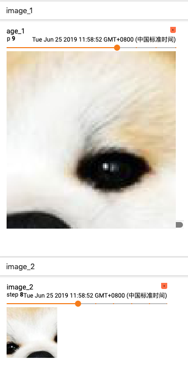
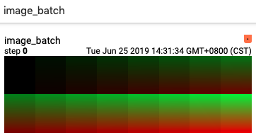
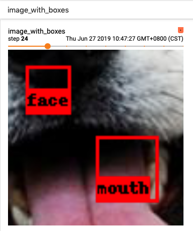
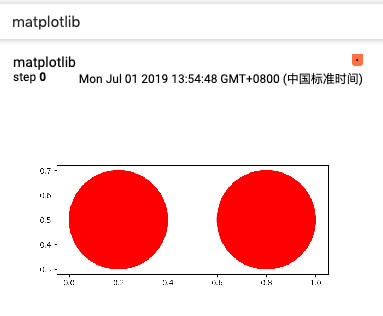
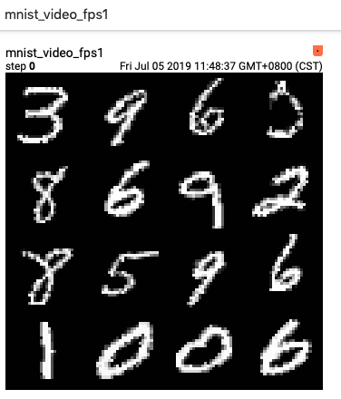

# IMAGES

### IMAGES

TensorBoard 的 **IMAGES** 栏目显示图片和视频。

class SummaryWriter 中用于打点标量数据的成员函数包括：

* <a href="#1"> add_image </a> ：在单个子框中显示一张图片
* <a href="#2"> add_images </a> ：在单个子框中显示多张图片
* <a href="#3"> add_image_with_boxes </a> ：在单个子框中显示一张图片，并加上识别网格
* <a href="#4"> add_figure </a> ：显示 matplotlib 的画图

为了减轻前后端交互的压力，每个子框中最多显示十张图片。

由于视频是多张图片连续播放的效果，所以通过<a href="#5">add_video</a>添加的视频数据，也在**IMAGES**栏目中显示。

<a name="1"></a>
## Class SummaryWriter 的成员函数 add_image

函数定义：

```python
def add_image(self, tag, img_tensor, global_step=None, walltime=None, dataformats='CHW')
    """Add image data to summary.

    Note that this requires the `pillow` package.
    
    :param tag: Data identifier.
    :type tag: string
    :param img_tensor: An `uint8` or `float` Tensor of shape `[channel, height, width]` where
                       `channel` is 1, 3, or 4. The elements in img_tensor can either have values
                       in [0, 1] (float32) or [0, 255] (uint8).
                       Users are responsible to scale the data in the correct range/type.
    :type img_tensor: numpy.array
    :param global_step: Global step value to record.
    :type global_step: int
    :param walltime: Optional override default walltime (time.time()) of event.
    :type walltime: float
    :param dataformats: 默认值为 'CHW'，各个字母的含义为 C-Channels, H-Height， W-Width。
                        可选值为 'HW','WH'，'CHW','CWH','HWC','WHC'。
    :type dataformats: string

    :Shape:
      If img_tensor.shape is `(3, H, W)`, corresponding dataformats should be 'CHW';
      If img_tensor.shape is `(H, W, 3)`, dataformats should be 'HWC';
      If image_tensor.shape is `(H, W)`, dataformats should be 'HW'.
    """
```

Demo-1 add_image-demo.py

```python
# coding=utf-8
import numpy as np
from PIL import Image
from tb_paddle import SummaryWriter


def random_crop(img):
    image = Image.open(img)
    w, h = image.size
    random_w = np.random.randint(0, w-100)
    random_h = np.random.randint(0, h-100)
    return image.crop((random_w, random_h, random_w + 100, random_h + 100))


# 创建 writer
writer = SummaryWriter('./log')

# 添加数据
step_num = 20
for step in range(step_num):
    image_path = "dog.jpg"
    # tag 为 image_1
    image_data_1 = np.array(random_crop(image_path))
    writer.add_image('image_1', image_data_1, step, dataformats='HWC')
    # tag 为 image_2
    image_data_2 = np.array(random_crop(image_path))
    writer.add_image('image_2', image_data_2, step, dataformats='HWC')

writer.close()
```

执行以下指令，启动服务器：

```
rm -rf ./log
python add_image-demo.py
tensorboard --logdir ./log/ --host 0.0.0.0 --port 6066
```

打开浏览器地址 [http://0.0.0.0:6066/](http://0.0.0.0:6066/) ，则可在 tensorboard 的 **IMAGES** 栏目查看图片：

<p align="center">
<br/>
图1. add_image - 在单个子框中显示一张图片 <br/>
</p>

<a name="2"></a>
##  Class SummaryWriter 的成员函数 add_images

函数定义：

```python
def add_images(self, tag, img_tensor, global_step=None, walltime=None, dataformats='NCHW'):
    """Add batched (4D) image data to summary.
    Besides passing 4D (NCHW) tensor, you can also pass a list of tensors of the same size.
    In this case, the ``dataformats`` should be `CHW` or `HWC`.
    Note that this requires the ``pillow`` package.

    :param tag: Data identifier.
    :type tag: string
    :param img_tensor: Image data. The elements in img_tensor can either have
                 values in [0, 1] (float32) or [0, 255] (uint8).
                 Users are responsible to scale the data in the correct range/type.
    :type img_tensor: numpy.array
    :param global_step: Global step value to record.
    :type global_step: int
    :param walltime: Optional override default walltime (time.time()) of event.
    :type walltime: float

    :Shape:
      img_tensor: Default is :math:`(N, 3, H, W)`, If ``dataformats`` is specified,
                  other shape will be accepted. e.g. NCHW or NHWC.
    """
```

Demo-2 add_images-demo.py

```python
# coding=utf-8
from tb_paddle import SummaryWriter
import numpy as np

batch_num = 16
Channels = 3 
Height = 224 
Width = 180 
img_batch = np.zeros((batch_num, Channels, Height, Width))

H_W = Height * Width
for i in range(batch_num):
    img_batch[i, 0] = np.arange(0, H_W).reshape(Height, Width) / H_W / batch_num * i 
    img_batch[i, 1] = (1 - np.arange(0, H_W).reshape(Height, Width) / H_W) / batch_num * i 

writer = SummaryWriter('./log')
writer.add_images('image_batch', img_batch, 0, dataformats='NCWH')
writer.close()
```

运行程序`add_images-demo.py`，则可在 tensorboard 的 **IMAGES** 栏目查看图片。

<p align="center">
<br/>
图2. add_images - 在单个子框中显示多张图片 <br/>
</p>

<a name="3"></a>
## Class SummaryWriter 的成员函数 add_image_with_boxes

```python
def add_image_with_boxes(self, tag, img_tensor, box_tensor, global_step=None,
                         walltime=None, dataformats='CHW', labels=None, 
                         box_color='red', text_color='white', box_thickness=1, **kwargs):
    """Add image and draw bounding boxes on the image.

    :param tag: Data identifier.
    :type tag: string
    :param img_tensor: Image data.
    :type img_tensor: numpy.array
    :param box_tensor: Box data (for detected objects),
                       box should be represented as [x1, y1, x2, y2].
    :type box_tensor: numpy.array
    :param global_step: Global step value to record.
    :type global_step: int
    :param walltime: Optional override default walltime (time.time()) of event.
    :type walltime: float
    :param labels: The strings to be shown on each bounding box.
    :type labels: list of string
    :param box_color: The color of box.
    :param text_color: The color of text
    :param box_thickness: The thickness of box edge.
    :type box_thickness: int

    Shape:
      img_tensor: Default is :math:`(3, H, W)`.
                  It can be specified with `dataformat` agrument, e.g. CHW or HWC.

      box_tensor: NX4,  where N is the number of boxes and
                  each 4 elememts in a row represents (xmin, ymin, xmax, ymax).
```

Demo-3 add_images_with_boxes-demo.py

```python
# coding=utf-8
import numpy as np
from PIL import Image
from tb_paddle import SummaryWriter


def random_crop(img):
    image = Image.open(img)
    w, h = image.size
    random_w = np.random.randint(0, w-100)
    random_h = np.random.randint(0, h-100)
    return image.crop((random_w, random_h, random_w + 100, random_h + 100))


# 创建 writer
writer = SummaryWriter('./log')

# 设置 box_tensoor 的取值
boxes_num = 2 
box_array = np.zeros([boxes_num,4])
box_array[0,0] = box_array[0,1] = 0 
box_array[0,2] = box_array[0,3] = 30
box_array[1,0] = box_array[1,1] = 50
box_array[1,2] = box_array[1,3] = 80

box_labels = ['face', 'mouth']

# 添加数据
step_num = 20
for step in range(step_num):
    image_path = "dog.jpg"
    image_data = np.array(random_crop(image_path))
    writer.add_image_with_boxes('image_with_boxes', image_data,
           box_array, step, dataformats='HWC', labels=box_labels)

writer.close()
```

运行程序`add_image_with_boxes.py`，则可在 tensorboard 的 **IMAGES** 栏目查看图片。

<p align="center">
<br/>
图3. add_image_with_boxes - 在单个子框中显示一张图片，并加上识别网格 <br/>
</p>

<a name="4"></a>
## class SummaryWriter 的成员函数 add_figure

```python
def add_figure(self, tag, figure, global_step=None, close=True, walltime=None):
    """Render matplotlib figure into an image and add it to summary.
    Note that this requires the ``matplotlib`` package.

    :param tag: Data identifier.
    :type tag: string
    :param figure: Figure or a list of figures.
    :type figure: matplotlib.pyplot.figure or list of matplotlib.pyplot.figure
    :param global_step: Global step value to record.
    :type global_step: int
    :param close: Flag to automatically close the figure.
    :type close: bool
    :param walltime: Optional override default walltime (time.time()) of event.
    :type walltime: float
    """
```

Demo-4 add_figure-demo.py

```python
# coding=utf-8
import matplotlib
matplotlib.use('TkAgg')
import matplotlib.pyplot as plt 

fig = plt.figure()

c1 = plt.Circle((0.2, 0.5), 0.2, color='r')
c2 = plt.Circle((0.8, 0.5), 0.2, color='r')

ax = plt.gca()
ax.add_patch(c1)
ax.add_patch(c2)
plt.axis('scaled')

from tb_paddle import SummaryWriter
writer = SummaryWriter('log')
writer.add_figure('matplotlib', fig)

writer.close()
```

运行程序`add_figure-demo.py`，则可在 tensorboard 的 **IMAGES** 栏目查看图片。

<p align="center">
<br/>
图4. add_figure - 显示 matplotlib 的画图 <br/>
</p>

<a name="5"></a>
## class SummaryWriter 的成员函数 add_video

函数定义：

```python
def add_video(self, tag, vid_tensor, global_step=None, fps=4, walltime=None):
    """Add video data to summary.
    
    :param tag: Data identifier.
    :type tag: string
    :param vid_tensor: Video data.
    :type vid_tensor: numpy.array
    :param global_step: Global step value to record.
    :type global_step: int
    :param fps: Frames per second.
    :type fps: float or int
    :param walltime: Optional override default walltime (time.time()) of event.
    :type walltime: float

    :Shape:
        vid_tensor:  `(Picture_num, Frame_num, Channel, Height, Weight)`，其中：
                      Picture_num 表示每一桢包括多少张(C,H,W)的图片；
                      Frame_num 表示该数据总计多少帧；
                      若 vid_tensor 的元素的数据类型为`uint8`，则取值范围是 [0, 255]；
                      若 vid_tensor 的元素的数据类型为`float`，则取值范围是 [0,1]。
```

使用 Tensorboard 的 **VIDEO** 功能，必须先安装`moviepy`：

```
pip install moviepy
```

Demo-5 add_video-demo.py

```python
# coding=utf-8
import numpy as np
import paddle
from tb_paddle import SummaryWriter
import matplotlib
matplotlib.use('TkAgg')

writer = SummaryWriter('log')

BATCH_SIZE = 768
reader_shuffle = paddle.reader.shuffle(
                     paddle.dataset.mnist.train(), buf_size=5120)

train_reader = paddle.batch(reader_shuffle, batch_size=BATCH_SIZE)

mat = np.zeros([BATCH_SIZE, 784])
for step_id, data in enumerate(train_reader()):
    # type(data) : <class 'list'>
    # len(data)  : BATCH_SIZE
    for i in range(len(data)):
        # type(data[i][0]) : <class 'numpy.ndarray'>
        # data[i][0].shape : (784,)
        mat[i] = data[i][0]

video_data = mat.reshape((16, 48, 1, 28, 28))
writer.add_video('mnist_video_fps4', vid_tensor=video_data)
writer.add_video('mnist_video_fps1', vid_tensor=video_data, fps=1)

writer.close()
```

<p align="center">
<br/>
图5. add_video - 显示视频 <br/>
</p>
