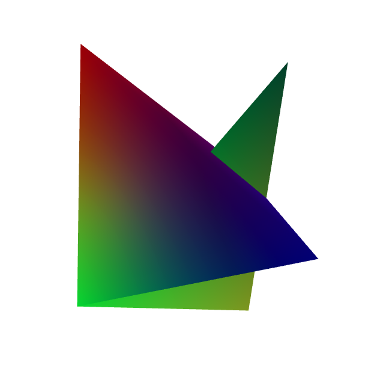

# MESH

## Class SummaryWriter 的成员函数 add_mesh

网格和点云(Meshes and points cloud)是表示3D 图形的重要数据类型，目前已广泛用于计算机视觉和计算机图形学中。随着 3D 数据在 VR/AR 等领域的普及，研究人员面临着许多新的挑战，例如从 2D 数据来实现 3D 几何重构、3D 云语义分割，等等。因此，可视化 3D形状的计算结果，有助于改进模型和分析算法的有效性。目前， [Tensorflow graphics](https://github.com/tensorflow/graphics) 通过 Tensoboard 的 **MESH** 栏目，提供了 3D 形状可视化的功能。

函数定义：

```python
def add_mesh(self, tag, vertices, colors=None, faces=None, 
    config_dict=None, global_step=None, walltime=None):
    """
    Add meshes or 3D point clouds to TensorBoard. 
    The visualization is based on Three.js, so it allows users to interact with the rendered object. 
    Besides the basic definitions such as vertices, faces, users can further provide 
    camera parameter, lighting condition, etc. Please check    
    https://threejs.org/docs/index.html#manual/en/introduction/Creating-a-scene for advanced usage. 

    :param tag: Data identifier.
    :type tag: string
    :param vertices: 顶点坐标列表，每一个顶点都为 (x,y,z)。
    :type vertices: numpy.array
    :param colors: 每一个顶点的颜色。
    :type colors: numpy.array
    :param faces: Indices of vertices within each triangle. 
    :type faces: numpy.array
    :param config_dict: Dictionary with ThreeJS classes names and configuration.
    :type config_dict: dict
    :param global_step: Global step value to record.
    :type global_step: int
    :param walltime: 实际时间。   
    :type walltime: float
    
    :shape:
      vertices : `(Batch, Number_of_vertices, 3)`
      colors   : `(Batch, Number_of_vertices, 3)` , 元素的取值范围是 [0, 255]。
      faces    : `(Batch, Number_of_vertices, 3)` , 元素的取值范围是 [0, Number_or_vertices]，类型为 `uint8`
    """
```

Demo-1 add_mesh-demo.py

```python
# coding=utf-8
import numpy as np
from tb_paddle import SummaryWriter

vertices_tensor = np.array([[
    [1, 1, 1],
    [-1, -1, 1],
    [1, -1, -1],
    [-1, 1, -1],
    [-1,-1,-1],
    [1, 1, -1]
]], dtype=float)

colors_tensor = np.array([[
    [255, 0, 0],
    [0, 255, 0],
    [0, 0, 255],
    [152, 0, 255],
    [180, 212, 0],
    [0, 99, 65]
]], dtype=int)

faces_tensor = np.array([[
    [0, 2, 3],
    [0, 3, 1],
    [0, 1, 2],
    [1, 3, 2],
    [4, 1, 3],
    [1, 4, 5],
]], dtype=int)

writer = SummaryWriter('log')
writer.add_mesh('my_mesh', vertices=vertices_tensor, 
    colors=colors_tensor, faces=faces_tensor)

writer.close()
```

执行以下指令，启动服务器

```
python add_mesh-demo.py
tensorboard --logdir ./log/ --host 0.0.0.0 --port 6066
```

打开浏览器地址 [http://0.0.0.0:6066/](http://0.0.0.0:6066/) ，即可在tensorboard的**MESH** 栏目中查看图表：

<p align="center">
<br/>
图1. add_mesh - 显示 3D 点云或网格
</p>
