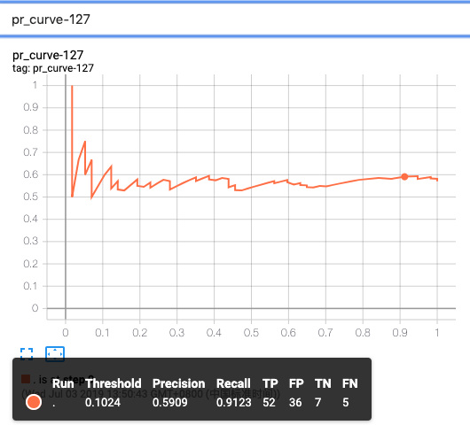
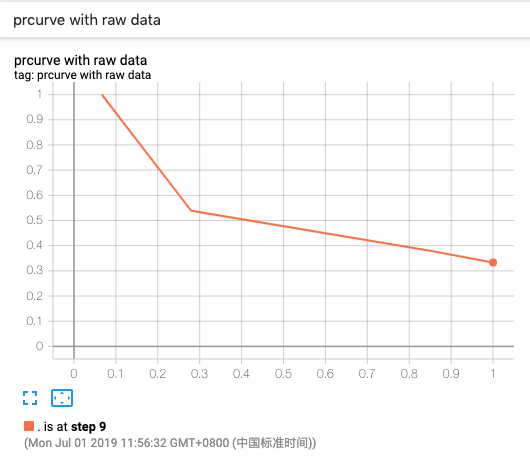

# PR CURVES

**precision and recall**

在模式识别、信息检索、二元分类等问题中，需要权衡 [precision and recall](https://en.wikipedia.org/wiki/Precision_and_recall) 的关系，其中 precision 是精确度或质量的衡量标准，而 recall 则是衡量结果的完整性的标准。 

举个例子：在图片识别任务中，一张图中有12条狗，若程序判定图中只有8条狗（实际判定结果 ：5条真是狗，另外3条不是狗，而是其他物体），那么该程序的 precision=5/8，recall=5/12。

**pr curve**

[pr curve](https://github.com/tensorflow/tensorboard/blob/master/tensorboard/plugins/pr_curve/README.md) 全称为 precison-recall curve，根据预测的概率值及其对应的准确答案来计算 precision-recall，并将结果保存并以折线图形式展示。

## Class SummaryWriter 的成员函数 add_pr_curve

函数定义：

```python
def add_pr_curve(self, tag, labels, predictions, global_step=None, 
                 num_thresholds=127, weights=None, walltime=None):
    """根据预测的概率值，以及其对应的标准答案计算 precision-recall 的结果。
    
    :param tag: Data identifier.
    :type tag: string
    :param labels: 标准答案，每一个元素都为 0/1（或者 True/False)。
    :type labels: numpy.array
    :param predictions: 预测结果，The probability that an element be classified as true，
                        Value should be set in [0, 1].
    :type predictions: numpy.array
    :param global_step: Global step value to record.
    :type global_step: int
    :param num_thresholds: Number of thresholds used to draw the curve.
    :type num_thresholds: int
    :param walltime: 实际时间。
    :type walltime: float
    """
```

Demo-1 add_pr_curve-demo.py

```python
# coding=utf-8
import numpy as np
from tb_paddle import SummaryWriter

writer = SummaryWriter('./log')

# 生成一个数组，包含 100 个 0/1  
labels_ = np.random.randint(2, size=100)

for step_ in range(10):
    predictions_ = np.random.rand(100)
    
    for num_thresholds_ in range(7, 197, 20):
        tag_ = 'pr_curve-' + str(num_thresholds_)
        writer.add_pr_curve(tag=tag_, 
                            labels=labels_, 
                            predictions=predictions_, 
                            global_step=step_, 
                            num_thresholds=num_thresholds_)

writer.close()
```

执行以下指令，启动服务器：

```
python add_pr_curve-demo.py
tensorboard --logdir ./log/ --host 0.0.0.0 --port 6066
```

打开浏览器地址 [http://0.0.0.0:6066/](http://0.0.0.0:6066/)，则可在 tensorboard 的**PR CURVES**栏目中查看图表：

<p align="center">
<br/>
图1. precision-recall 曲线 <br/>
</p>

其中`Precison`为横坐标，`Recall`为纵坐标。

## class SummaryWriter 的成员函数 add_pr_curve_raw

```
def add_pr_curve_raw(self, tag, true_positive_counts,
                         false_positive_counts,
                         true_negative_counts,
                         false_negative_counts,
                         precision,
                         recall,
                         global_step=None,
                         num_thresholds=127,
                         weights=None,
                         walltime=None):
    """Adds precision recall curve with raw data.

    :param tag: Data identifier.
    :type tag: string
    :param true_positive_counts: true positive counts.
    :type true_positive_counts: numpy.array
    :param false_positive_counts: false positive counts.
    :type false_positive_counts: numpy.array
    :param true_negative_counts: true negative counts.
    :type true_negative_counts: numpy.array
    :param false_negative_counts: false negative counts.
    :type false_negative_counts: numpy.array
    :param precision: precision
    :type precision: numpy.array
    :param recall: recall
    :type recall: numpy.array
    :param global_step: Global step value to record
    :type global_step: int
    :param num_thresholds: Number of thresholds used to draw the curve.
    :type num_thresholds: int
    :param walltime: Optional override default walltime (time.time()) of event
    :type walltime: float
    """
```

Demo-2 add_pr_curve_raw-demo.py

```python
# coding=utf-8
import numpy as np
from tb_paddle import SummaryWriter

writer = SummaryWriter('log')

true_positive_counts = [75, 64, 21, 5, 0]
false_positive_counts = [150, 105, 18, 0, 0]
true_negative_counts = [0, 45, 132, 150, 150]
false_negative_counts = [0, 11, 54, 70, 75] 
precision = [0.3333333, 0.3786982, 0.5384616, 1.0, 0.0]
recall = [1.0, 0.8533334, 0.28, 0.0666667, 0.0]

step = 0 
for threshold in range(7, 207, 20):
    writer.add_pr_curve_raw('prcurve with raw data',
               true_positive_counts, false_positive_counts, 
               true_negative_counts, false_negative_counts, 
               precision, recall, global_step=step,
               num_thresholds=threshold)
    step += 1

writer.close()
```

运行程序`add_pr_curve_raw-demo.py`，则可在 tensorboard 的**PR CURVES**栏目中查看图表：

<p align="center">
<br/>
图2. add_pr_curve_raw - 显示 precision-recall 曲线 <br/>
</p>
