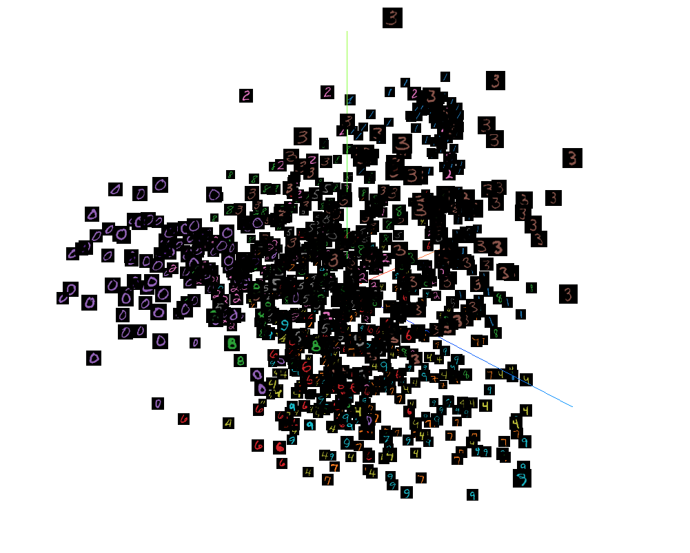

# PROJECTOR

TensorBoard 的 **PROJECTOR** 栏目全称为 Embedding Projector，这是一个交互式的嵌入可视化工具。

class SummaryWriter 中用于打点 embedding 高维数据的成员函数为`add_embedding`。

`add_embedding` 函数的定义与实现均在文件[../tb_paddle/summary_writer.py](../tb_paddle/summary_writer.py) 中。

##  Class SummaryWriter 的成员函数 `add_embedding`

Demo-1  add\_embedding-mnist.py

```python
# coding=utf-8
import numpy as np
import paddle
from tb_paddle import SummaryWriter

writer = SummaryWriter('log')

BATCH_SIZE = 1024
reader_shuffle = paddle.reader.shuffle(paddle.dataset.mnist.train(), buf_size=5120)

train_reader = paddle.batch(
    reader_shuffle,
    batch_size=BATCH_SIZE)

mat = np.zeros([BATCH_SIZE, 784])
metadata = np.zeros(BATCH_SIZE)

data_dict = {}
for step_id, data in enumerate(train_reader()):
    # type(data) : <class 'list'>
    # len(data)  : BATCH_SIZE
    # type(data[i]) : <class 'tuple'>
    # type(data[i][0]) : <class 'numpy.ndarray'>
    # data[i][0].shape : (784,)
    # type(data[i][1]) : <class 'int'>
    data_dict[step_id] = data
    if step_id > 0:
        break 

for i in range(len(data_dict[0])):
    mat[i] = data_dict[0][i][0]
    metadata[i] = data_dict[0][i][1]

label_img = mat.reshape(BATCH_SIZE, 1, 28, 28)
writer.add_embedding(mat=mat, metadata=metadata, label_img=label_img, global_step=step_id)

writer.add_scalar('echo', 1, 0)
writer.close()
```

执行以下指令，启动服务器：

```
python add_embedding-mnist.py
tensorboard --logdir ./log/ --host 0.0.0.0 --port 6066
```

打开浏览器地址 [http://0.0.0.0:6066/](http://0.0.0.0:6066/)，点击`PROJECTOR`，即可查看 tensorboard 中的图表：

<p align="center">
<br/>
图1. add_embedding - 显示嵌入 <br/>
</p>

## 嵌入可视化（Embedding Visualization）

由于人类的眼睛只能观察到3维的物体，因此对于高维数据，可以通过嵌入[Embedding](https://arxiv.org/pdf/1611.05469v1.pdf)，将其映射(project)到2D/3D空间中显示。

为了更直观地显示 embedding 的计算结果，Tensorboard 提供了 Projector 界面来可视化高维向量之间的关系。当前 Projector 的页面设计了交互式的工具栏，便于用户更直观地查看数据，并进行分析。

### 交互式工具栏

Tensorboard 的 Embedding Projector 有三个控制板(panel)：

* 左上方的 `DATA` panel，可以选择`data`,`label`,`color`, `Load`, `Download`, `sphereize data`(数据以球状显示) 等操作。
* 左下方的 `Projection` panel，可以选择 projection 的方法：`UMAP`, `t-SNE`, `PCA`, `CUSTOM`。  
* 右边的 `Inspector` panel, 你可以在 `Search` 中输入关键字，则会高亮相应的数据，并可进一步选择 `Isolate`, `Clear Selection`, `Show All Data` 等操作。

### Projection 方法

当前 `Embedding Projector` 提供了下述四种降维方法：
* UMAP : [Uniform Manifold Approximation and Projection](https://umap-learn.readthedocs.io/en/latest/) 是一种非线性的降维方法，在满足特定的数据分布条件下，可用模糊拓扑结构对流形进行建模。
* t-SNE : [t-SNE](https://en.wikipedia.org/wiki/T-distributed_stochastic_neighbor_embedding) 是一种非常流行的非线性数据降维方法，非常适用于将高维数据嵌入到 2D/3D 空间以实现可视化。由于t-SNE 可以保存局部结构，很适用于探索局部邻域、寻找聚类等，具体使用方法可参考[Effective t-SNE](https://distill.pub/2016/misread-tsne/).
* PCA : Pricipal Component Analysis, 是一种线性降维方法，可高效地用于检查数据的全局结构(global geometry)。
* Custom : 自定义线性投影有助于发现数据集中有意义的方向，比如语言生成模型中正式的语调和随意的语调之间的区别，从而有助于设计出适应性更佳的机器学习系统。

### Embedding 的应用

Embedding 在机器学习/深度学习领域的应用很广泛，推荐系统，NLP/CV/Speech 等都会使用 Embedding 来实现数据降维与分类等。

* 在训练单词向量时，如果语义相近的单词所对应的向量在空间中的距离比较接近，则该自然语言模型的效果比较好。  
* 图片分类中，如果同一类图片经过卷积处理后，在空间中的距离比较接近，则该模型的效果比较好。  

在数据集中应用降维，有以下好处：

1. 随着数据维度不断降低，存储数据所需的空间也会随之减少。
2. 低维数据有助于减少计算/训练用时。
3. 一些算法在高维度数据上容易表现不佳，降维可提高算法可用性。
4. 降维可以用删除冗余特征解决多重共线性问题。比如我们有两个变量：“一段时间内在跑步机上的耗时”和“卡路里消耗量”。这两个变量高度相关，在跑步机上花的时间越长，燃烧的卡路里自然就越多。因此，同时存储这两个数据意义不大，只需一个就够了。
5. 降维有助于数据可视化。如前所述，如果数据维度很高，可视化会变得相当困难，而绘制 `2D/3D` 数据的图表就非常简单。

