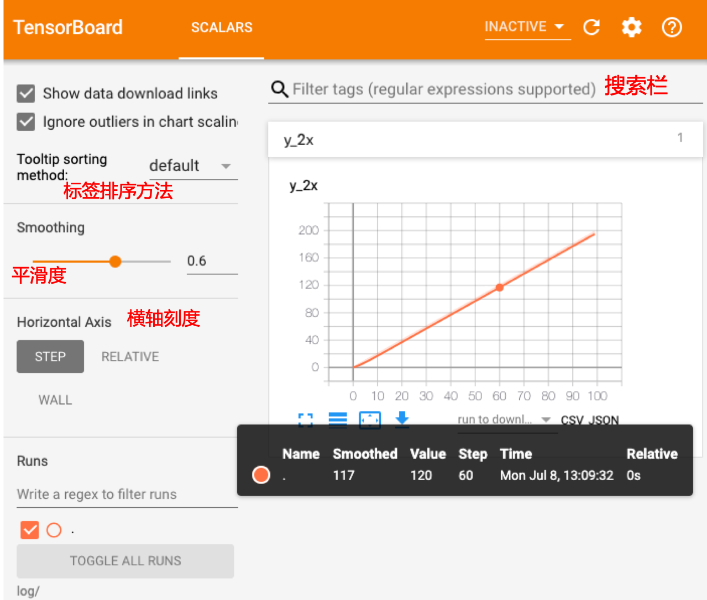
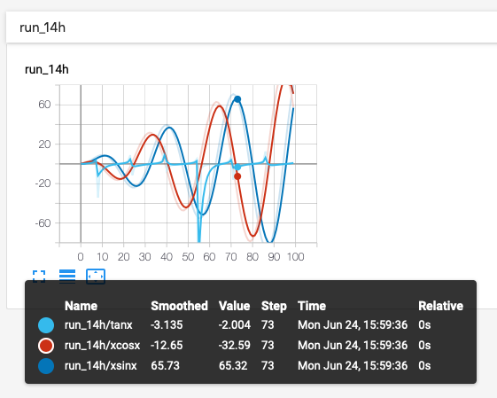
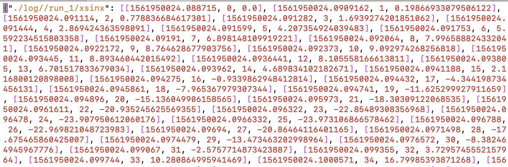

# SCALARS

TensorBoard 的 **SCALARS** 栏目显示折线图。

class SummaryWriter 实现的用于添加标量数据的成员函数包括：

<p align="center">
|API|作用|
|:---:|:---:|
| `add_scalar` | 在单张图中画一条折线 |
| `add_scalars` | 在单张图中画多条折线 |
| `export_scalars_to_json` | 将数据保存为 json 格式 |
</p>

## Class SummaryWriter 的成员函数 add_scalar

函数定义：

```pyhton
def add_scalar(self, tag, scalar_value, global_step=None, walltime=None):
    """Add scalar data to summary.

    :param tag: Data identifier.
    :type tag: string
    :param scalar_value: Value to save.
    :type scalar_value: float
    :param global_step: Global step value to record.
    :type global_step: int
    :param walltime: Optional override default walltime (time.time()) of event.
    :type walltime: float
    """ 
```

demo-1   add_scalar-demo.py

```python
# coding=utf-8
from tb_paddle import SummaryWriter

writer = SummaryWriter(logdir='./log/')
for i in range(100):
    writer.add_scalar('y=2x', i * 2, i)

writer.close()
```

执行以下指令，启动服务器：

```
python add_scalar-demo.py
tensorboard --logdir ./log/ --host 0.0.0.0 --port 6066
```

打开浏览器地址 [http://0.0.0.0:6066/](http://0.0.0.0:6066/)，则可在 tensorboard 的**SCALARS**栏目中查看图表：

<p align="center">
<br/>
图1. add_scalar - 在单张图中显示一条折线 <br/>
</p>

### SCALARS 栏目的交互操作

* 点击每个图表左下角的图标可以展开图表。
* 选择图表中的矩形区域可以放大。
* 双击图表将缩小。
* 鼠标停留在图表上会产生十字线，并在图表的下方显示一个数值框。

### SCALARS 栏目的功能选择按钮

* 左上方的`Show data download links` : 显示图表下载链接，将图表保存为`.svg`格式的图片；
* 左上方的`Ignore outliers in chart scaling` : 排除图表中的异常值；
* 左边面板中的`Tooltip sorting method` : 图表的排序方法，可选择`default`, `descending`, `ascending`, `nearest`；
* 左边面板中的`Smoothing` : 曲线的平滑度；
* 左边面板中的`Horizontal Axis` : 横轴刻度，可选择:
	
	+ STEP : 横轴显示训练步数;
	+ RELATIVE : 相对时间，指距程序运行开始的用时；
	+ WALL : 绝对时间；

* 左下方的`RUNS` : 列出了所有的SummaryWriter，可以选择显示某一个或某几个。

## Class SummaryWriter 的成员函数 add_scalars

函数定义：

```python
def add_scalars(self, main_tag, tag_scalar_dict, global_step=None, walltime=None):
    """Adds many scalar data to summary.
    Note that this function also keeps logged scalars in memory. In extreme case it explodes your RAM.
    :param main_tag: The parent name for the tags.
    :type main_tag: string
    :param tag_scalar_dict: Key-value pair storing the tag and corresponding values.
    :type tag_scalar_dict: dict
    :param global_step: Global step value to record.
    :type global_step: int
    :param walltime: Optional override default walltime (time.time()) of event.
    :type walltime: float
    """
```

demo-2  add_scalars-demo.py

```python
# coding=utf-8
import numpy as np
from tb_paddle import SummaryWriter
writer = SummaryWriter('./log/')
r = 5 
for i in range(100):
    writer.add_scalars('run_14h', {'xsinx':i*np.sin(i/r),
                                    'xcosx':i*np.cos(i/r),
                                    'tanx': np.tan(i/r)}, i)
writer.close()
```

运行程序`add_scalars-demo.py`，则可在 tensorboard 的**SCALARS**栏目中查看图表：

<p align="center">
<br/>
图2. add_scalars - 在单张图中显示多条折线 <br/>
</p>

## Class SummaryWriter 的成员函数 export_scalars_to_json

函数 `export_scalars_to_json` 用于将函数 `add_scalars` 所添加的数据值，以 .json 文件的格式存到磁盘中。数据格式为：
 `{"fw_logdir/main_tag/tag": [[timestamp, global_step, value], ...], [[...]], ...}`

demo-3 export_scalars_to_json-demo.py

```python
# coding=utf-8
import numpy as np
from tb_paddle import SummaryWriter

writer = SummaryWriter('./log/')

r = 5 
for i in range(100):
    writer.add_scalars('run_1', {'xsinx':i*np.sin(i/r),
                                    'xcosx':i*np.cos(i/r),
                                    'tanx': np.tan(i/r)}, i)

writer.export_scalars_to_json("./all_scalars.json")
writer.close()
```

执行以下指令，运行程序：

```
rm -rf ./log
python export_scalars_to_json-demo.py
```

则在当前目录中新生成了一个文件 all_scalars.json :

<p align="center">
<br/>
图3. export_scalars_to_json - 将数据保存为 json 格式  <br/>
</p>
