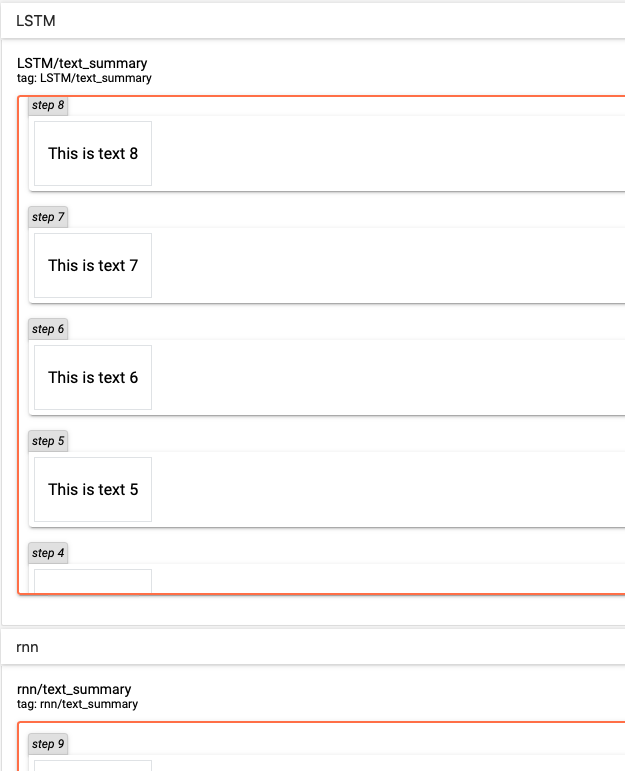

# TEXT

TensorBoard 的[TEXT](instructions/TEXT_instructions.md)栏目显示文本。

class SummaryWriter 中用于打点文本数据的成员函数为`add_text`。

## Class SummaryWriter 的成员函数 add_text

函数定义：

```python
def add_text(self, tag, text_string, global_step=None, walltime=None):
    """Add text data to summary.

    :param tag: Data identifier.
    :type tag: string
    :param text_string: String to save.
    :type text_string: string
    :param global_step: Global step value to record
    :type global_step: int
    :param walltime: Optional override default walltime (time.time()) of event
    :type walltime: float
    """
```

Demo-1 add_text-demo.py

```python
# coding=utf-8
from tb_paddle import SummaryWriter

writer = SummaryWriter('./log')

for step in range(10):
    text = 'This is text ' + str(step)  
    writer.add_text('LSTM', text, step)
    writer.add_text('rnn', text, step)

writer.close()
```

执行以下指令，启动服务器：

```
python add_text-demo.py
tensorboard --logdir ./log/ --host 0.0.0.0 --port 6066
```

打开浏览器地址 [http://0.0.0.0:6066/](http://0.0.0.0:6066/)，即可在tensorboard的**TEXT**栏目中查看文本：

<p align="center">
<br/>
图1. add_text - 显示文本 <br/>
</p>
